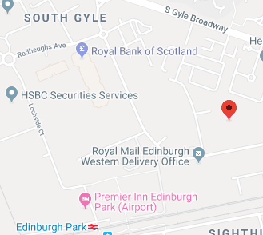

```{r setup, include = FALSE}
# Load packages required
library(knitr)
library(magrittr)
library(kableExtra)

knitr::opts_chunk$set(echo = FALSE)

# Create data frame for table
table_contents <- data.frame(c("Text", "Text",
                               "Text", "Text",
                               "Text"),
                             c(1:5))
```


## Bio

- Bullet point
- Bullet point with *italic text*
- Bullet point with **bold text**


## David's work

Two main projects:

- Hospital Standardised Mortality Ratios
    - Using logistic regression to predict the number of deaths to occur within acute hospitals across Scotland
    
- Reproducible Analytical Pipeline
    - Using R and RMarkdown to automate a publication process start to finish

## Perks and Benefits

There are a number of perks and benefits that comes with working at ISD:

- Flexible working: come and go as you please (within reason!)
- Good holiday allowance: up to 33 days + 8 public holidays
- Good work-life balance: variety of working patterns available

And most importantly...

- Jeans are acceptable

## The Locations

ISD has offices in a number of locations, but the two main ones are in Glasgow and Edinburgh.

<div style="float: left; width: 50%; text-align: left">
**The Edinburgh Office**
```{r out.width = "70%", fig.align = 'left'}

```
</div>

<div style="float: right; width: 50%;">
**The Glasgow Office**
```{r out.width = "65%", fig.align = 'left'}

```
</div>

## Recruitment

The recruitment process is usually two stages:

- Application form with person statement
    - Education/employment history
    - Personal Statement
    
- Competency-based interview
    - Asked to provide examples of times you have demonstrated key competencies required for the job
    - Potential for a technical question

## This slide has two columns 
<!-- It seems easier to do with htmltags than with other ways --> 
<div style="float: left; width: 50%; text-align: left">
* Bullet point
* Bullet point with *italic text*
* Bullet point with **bold text**
</div>

<div style="float: right; width: 50%;">
```{r out.width = "100%", fig.align = 'right'}
hist(rnorm(100))
```
</div>


## Slide title

[ISD homepage](http://www.isdscotland.org/)

## Slide title

```{r, echo = FALSE}
    kable(table_contents,
          col.names = c("Column heading", "Column heading"),
          format = "markdown")
```